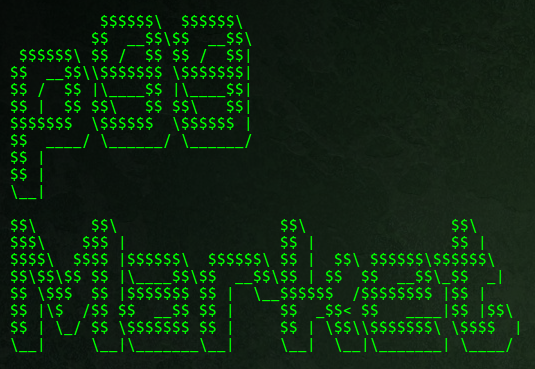
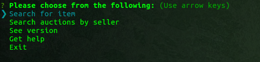
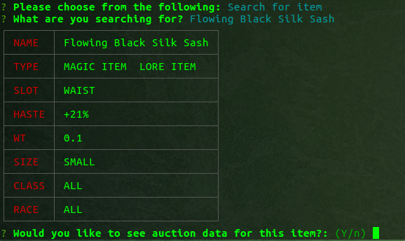
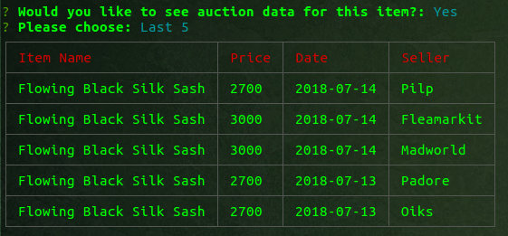
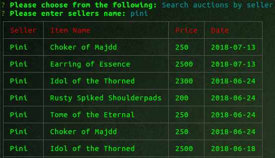

# p99

The official CLI for www.P99market.com

<p align="center">
  
</p>

## Description
p99 provides a clean and efficient command line interface for:
* Auto-completed search for items
* Current auction data for items
* Search auctions by seller


## Installing
Simply, install `p99` with the node package manager:

```sh
$ npm install p99
```


## Usage
Once installed use the command p99 to launch the interface.
```sh
$ p99
```
<p align="center">
  
</p>

* Search for items
<p align="center">
  
</p>

* View auction data
<p align="center">
  
</p>

* Search auctions by seller 
<p align="center">
  
</p>


#
## Built With

* [inquirer](https://www.npmjs.com/package/inquirer)  
* [CLI-table](https://www.npmjs.com/package/cli-table)
* [axios](https://www.npmjs.com/package/axios) 


## License

This project is licensed under the MIT License - see the [LICENSE.md](LICENSE.md) file for details


